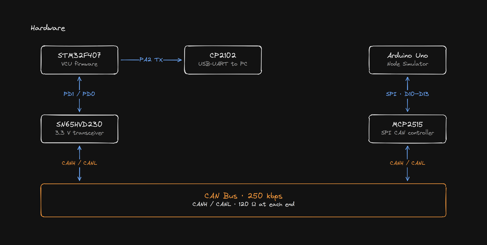
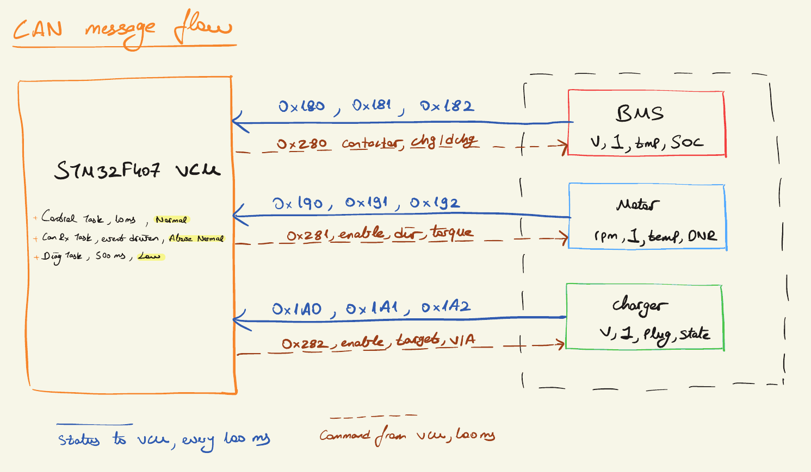
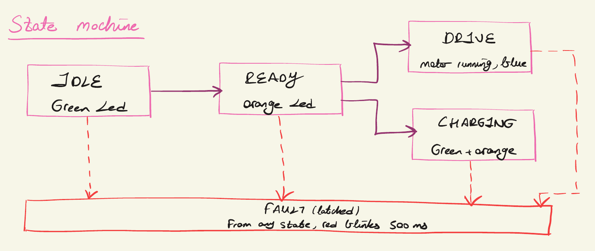

# STM32 EV VCU — Electric Vehicle Control Unit

[](https://github.com/sarparslan/stm32-ev-vcu/actions/workflows/ci.yml)

A FreeRTOS-based **Vehicle Control Unit (VCU / ECU)** for an electric vehicle, running on an
STM32F407. The VCU listens to the **BMS**, **Motor controller** and **Charger** over a CAN bus,
makes the high-level control decisions (drive / charge / fault handling), and sends command
frames back to each node.

Because real BMS / motor / charger hardware isn't on the bench, an **Arduino Uno + MCP2515**
acts as a CAN node simulator, broadcasting fake status frames so the VCU has something to react to.



---

## Hardware

| Part          | Role                                                              |
| ------------- | ----------------------------------------------------------------- |
| **STM32F407** | Main VCU — runs the control firmware (this repo, `Core/`)         |
| **Arduino Uno** | CAN node simulator — feeds fake BMS/Motor/Charger status        |
| **MCP2515**   | SPI ↔ CAN controller for the Arduino                              |
| **SN65HVD230**| 3.3 V CAN transceiver for the STM32                              |
| **CP2102**    | USB ↔ UART bridge for reading the STM32 debug console            |

## Wiring

<table>
<tr>
<td>

**Arduino Uno → MCP2515** (SPI)

| Arduino | MCP2515 |
| ------- | ------- |
| 5V      | VCC     |
| GND     | GND     |
| D13     | SCK     |
| D12     | SO      |
| D11     | SI      |
| D10     | CS      |

</td>
<td valign="top">

**SN65HVD230 → STM32F407** (CAN1)

| SN65HVD230 | STM32F407     |
| ---------- | ------------- |
| CAN TX     | PD1 (CAN1_TX) |
| CAN RX     | PD0 (CAN1_RX) |
| GND        | GND           |
| 3.3V       | 3V3           |

</td>
</tr>
<tr>
<td valign="top">

**MCP2515 → SN65HVD230** (CAN bus)

| MCP2515 | SN65HVD230 |
| ------- | ---------- |
| CANH    | CANH       |
| CANL    | CANL       |

</td>
<td valign="top">

**CP2102 → STM32F407** (UART2 debug)

| CP2102 | STM32F407       |
| ------ | --------------- |
| RXD    | PA2 (USART2_TX) |
| GND    | GND             |

</td>
</tr>
</table>

> The MCP2515 on most breakout boards uses an **8 MHz** crystal — the Arduino sketch is set to
> `MCP_8MHZ`. If your board has a 16 MHz crystal, change `MCP_CRYSTAL` in `can_node_sim.ino`.
> Don't forget a **120 Ω** termination resistor across CANH/CANL at each end of the bus
> (the SN65HVD230 and most MCP2515 boards already include one).

---

## Bus configuration

- **CAN bitrate:** 250 kbps (both sides must match)
- **UART debug:** 115200 baud, 8N1
- Status values that can go negative are sent with a fixed offset on the wire
  (`temp +40`, `current/rpm +32000`); multi-byte values are little-endian.

### CAN message matrix

Each node publishes 3 status frames (node → VCU) and accepts 1 command frame (VCU → node).



**BMS**

| ID      | Direction | Contents                                |
| ------- | --------- | --------------------------------------- |
| `0x180` | BMS → VCU | voltage + current                       |
| `0x181` | BMS → VCU | temp + SOC + state                      |
| `0x182` | BMS → VCU | packed flags                            |
| `0x280` | VCU → BMS | contactor / charge / discharge request  |

**Motor**

| ID      | Direction   | Contents                            |
| ------- | ----------- | ----------------------------------- |
| `0x190` | Motor → VCU | rpm + current                       |
| `0x191` | Motor → VCU | temp + state + direction            |
| `0x192` | Motor → VCU | flags + alive counter               |
| `0x281` | VCU → Motor | enable / direction / torque / regen |

**Charger**

| ID      | Direction     | Contents                            |
| ------- | ------------- | ----------------------------------- |
| `0x1A0` | Charger → VCU | voltage + current                   |
| `0x1A1` | Charger → VCU | state + plug detect                 |
| `0x1A2` | Charger → VCU | flags + alive counter               |
| `0x282` | VCU → Charger | charge enable / target V / target A |

---

## Firmware architecture

The control logic lives in `Core/` and is split into small modules:

| Module                 | Responsibility                                            |
| ---------------------- | --------------------------------------------------------- |
| `app.c`                | Glue: control step, command TX, debug trace               |
| `vehicle_control.c`    | The ECU state machine (IDLE / READY / DRIVE / CHARGING / FAULT) and fault logic |
| `bms_can.c`            | Encode/decode BMS frames + status struct                  |
| `motor_can.c`          | Encode/decode Motor frames + status struct                |
| `charger_can.c`        | Encode/decode Charger frames + status struct              |
| `can_bus.c`            | CAN init, RX queue, TX, status mutex                      |
| `led_diag.c`           | On-board LED diagnostics following the ECU state          |
| `ev_config.h`          | Safety thresholds, CAN IDs, timing constants              |
| `ev_types.h`           | Shared enums and status/command structs                   |

Built on **FreeRTOS** with three tasks:

- **ControlTask** — critical control loop, 10 ms period, normal priority
  (read status → decide → send commands every 100 ms → update LED).
- **CanRxTask** — event-driven, highest priority (above normal): the RX interrupt pushes raw
  frames into a queue and this task wakes up to decode them into status structs.
- **DiagTask** — low priority, dumps the CAN trace to the console every 500 ms
  (kept slow so `printf` never blocks the control loop).

The VCU also enforces safety thresholds (over-temp, over/under-voltage, comm timeout) defined in
`ev_config.h` and trips into a FAULT state with a blinking diagnostic LED when a node misbehaves
or goes silent.



---

## Repository layout

```
.
├── Core/              STM32 firmware (application source + headers)
├── Drivers/           STM32 HAL + CMSIS (generated)
├── Middlewares/       FreeRTOS (generated)
├── docs/              Architecture diagrams used in this README
├── Arduino/
│   └── can_node_sim/  Arduino Uno + MCP2515 CAN node simulator
├── tests/             Host-side unit tests (CAN codecs + state machine)
├── scripts/           Command-line firmware build used by CI
├── stm32-ev-vcu.ioc   STM32CubeMX/CubeIDE project configuration
└── *.ld               Linker scripts
```

---

## Tests

The CAN codecs and the vehicle state machine don't depend on the hardware, so they are
unit-tested on the host with the regular C compiler. The HAL is replaced by a small stub with
a fake `HAL_GetTick()`, which also lets the tests simulate timeouts without actually waiting.

```bash
make -C tests
```

What is covered:

- **Wire format** — every status frame is decoded from raw bytes (offsets, little-endian,
  signed values, flag bits) and every command payload is checked byte by byte.
- **State machine** — IDLE / READY / DRIVE / CHARGING transitions for the drive and charge paths.
- **Fault handling** — each threshold tested right at its boundary, comm timeout (including
  `HAL_GetTick()` wrap-around), node-reported faults, and that a FAULT stays latched.

On every push, [GitHub Actions](.github/workflows/ci.yml) runs the unit tests (with
AddressSanitizer + UBSan) and builds the firmware with `arm-none-eabi-gcc`, treating warnings in
the application code as errors. The same firmware build can be run locally:

```bash
scripts/build_firmware.sh
```

---

## Build & run

### STM32 (VCU)

1. Open the project in **STM32CubeIDE** (`File → Open Projects from File System…` → select this folder).
2. Build (**Project → Build**) and flash to the STM32F407 with an ST-Link.
3. Open a 115200 8N1 serial terminal on the CP2102 port to watch the live CAN trace.

   On **macOS** you can use the built-in `screen`:

   ```bash
   ls /dev/cu.*                          # find the CP2102 port
   screen /dev/cu.usbserial-0001 115200  # open it at 115200 baud
   ```

   To quit `screen`: press `Ctrl-A` then `K`, and confirm with `y`.
   On **Linux** the port is usually `/dev/ttyUSB0`; on **Windows** use PuTTY/Tera Term on the COM port.

### Arduino (node simulator)

1. Install the **`coryjfowler/MCP_CAN_lib`** library in the Arduino IDE.
2. Open `Arduino/can_node_sim/can_node_sim.ino`, select **Arduino Uno**, and upload.
3. The simulator broadcasts BMS / Motor / Charger status frames at 250 kbps every 100 ms.

Once both are powered and the CAN bus is wired (with termination), the STM32 console will show the
decoded node status and the command frames it sends back.
